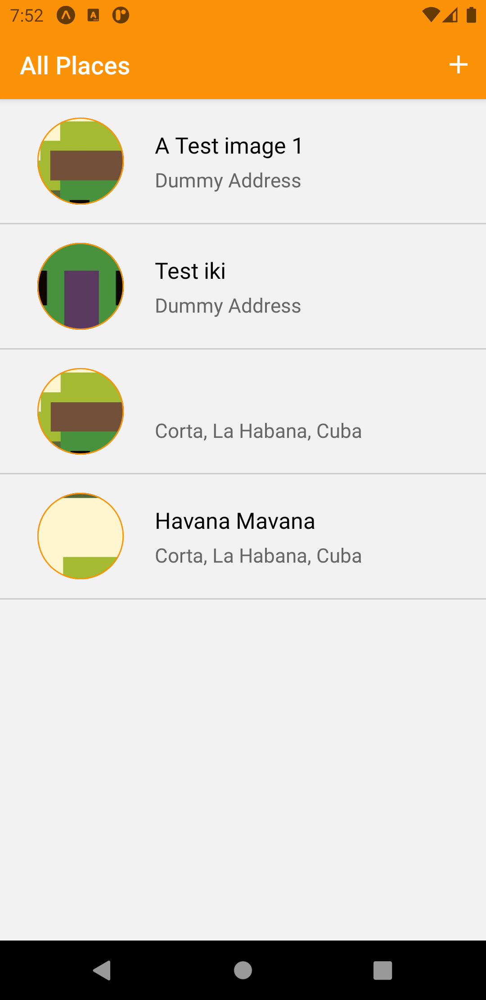
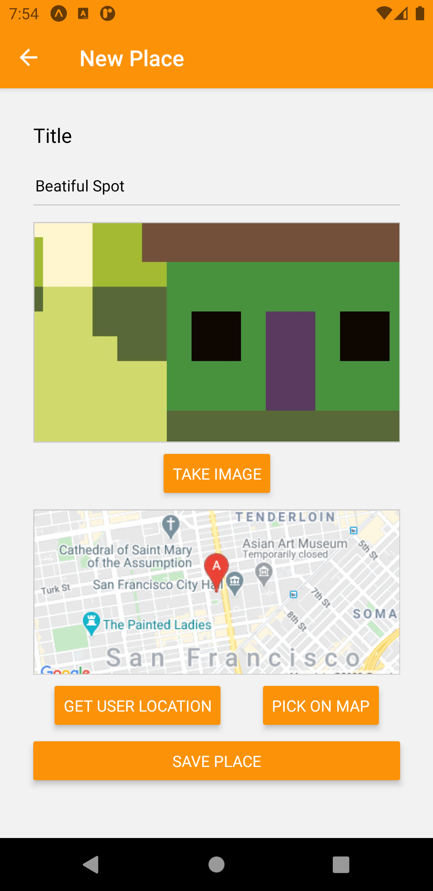
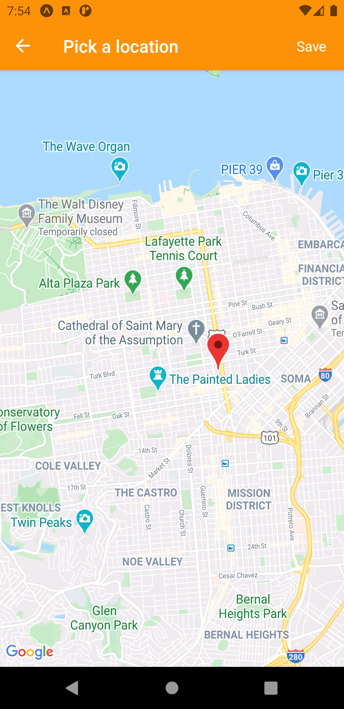
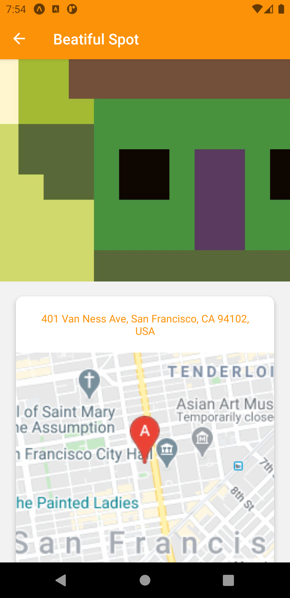
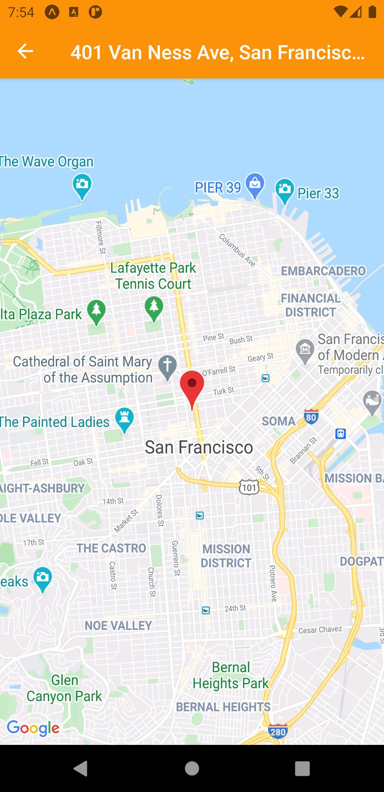
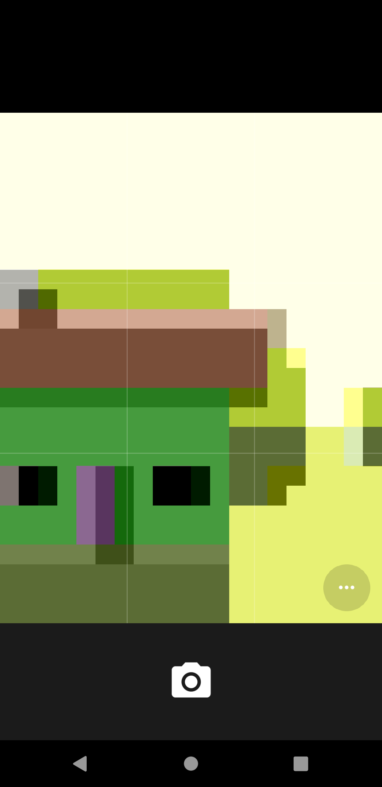

> In this app you can find:

- React Navigation 5 usage (sending & receiving parameters between screens & components & navigator)
- Camera usage
- Temp storage usage
- SQLite usage
- Google Maps usage
- ENV vars usage (& keeping them secret)

# Screenshots

<div style="display: flex;">






</div>

# Some important installations

expo install expo-image-picker

expo install expo-permissions

expo install expo-file-system

expo install expo-sqlite

expo install expo-location

npm install react-native-dotenv //SEEMS NO NEED !!! (check r_shop_app README.md)

expo install react-native-maps

The steps defined under "Configuration" section might be required in the MapView Expo API Reference
(https://docs.expo.io/versions/v38.0.0/sdk/map-view/)

# Google: Maps Static API

https://developers.google.com/maps/documentation/maps-static/overview

The Maps Static API lets you embed a Google Maps image on your web page without requiring JavaScript or any dynamic page loading. The Maps Static API service creates your map based on URL parameters sent through a standard HTTP request and returns the map as an image you can display on your web page. You don't need to do anything "special" to get this image to show up on the page. No JavaScript is required. All we needed to do was create a URL, and place it within an  tag. You can place a Google Static Maps anywhere on your webpage where you can place an image.

```
https://maps.googleapis.com/maps/api/staticmap?center=Brooklyn+Bridge,New+York,NY&zoom=13&size=600x300&maptype=roadmap
&markers=color:blue%7Clabel:S%7C40.702147,-74.015794&markers=color:green%7Clabel:G%7C40.711614,-74.012318
&markers=color:red%7Clabel:C%7C40.718217,-73.998284
&key=YOUR_API_KEY
```

# Google: Geocoding API

https://developers.google.com/maps/documentation/geocoding/overview

> What is geocoding?

Geocoding is the process of converting addresses (like "1600 Amphitheatre Parkway, Mountain View, CA") into geographic coordinates (like latitude 37.423021 and longitude -122.083739), which you can use to place markers on a map, or position the map.

> Reverse geocoding (address lookup)

The term geocoding generally refers to translating a human-readable address into a location on a map. The process of doing the opposite, translating a location on the map into a human-readable address, is known as reverse geocoding.

# Publishing to Expo

> to publish:

```
expo publish
```

- created account (on the fly) : hazy.3@gm x...6.hn

- Project page: https://expo.io/@hazyikmis/great-places

> output of the publishing:

Bundle Size
┌ index.ios.js 1.53 MB
├ index.android.js 1.54 MB
├ index.ios.js.map 5.12 MB
└ index.android.js.map 5.15 MB

Learn more about JavaScript bundle sizes: https://expo.fyi/javascript-bundle-sizes

Analyzing assets
Saving assets
No assets changed, skipped.

Processing asset bundle patterns:

- D:\hll\udemy courses\React Native Tutorial for Beginners - Crash Course 2020\react-native\rn_places\*\*\*

Uploading JavaScript bundles
Publish complete

� Manifest: https://exp.host/@hazyikmis/great-places/index.exp?sdkVersion=38.0.0 Learn more: https://expo.fyi/manifest-url
⚙️ Project page: https://expo.io/@hazyikmis/great-places Learn more: https://expo.fyi/project-page

# Building Standalone Apps

https://docs.expo.io/distribution/building-standalone-apps/

```
expo build:android -t app-bundle
expo fetch:android:keystore
```

The "aab" bundle created by expo: https://exp-shell-app-assets.s3.us-west-1.amazonaws.com/android/%40hazyikmis/great-places-d671ead12ce84844871bb0eacb1a9a4c-signed.aab

> Keystroke credentials copied to env.js

"expo build:android -t app-bundle" command produces app bundles. An Android App Bundle is a publishing format that includes all your app’s compiled code and resources, and defers APK generation and signing to Google Play. This bundle is an aab file, and it is not installable directly to device or emulator. For more info please check: https://developer.android.com/guide/app-bundle

In order to produce installable "apk" files you need to use "bundletool". For more info: https://developer.android.com/studio/command-line/bundletool#device_specific_apks

```
expo build:android -t apk
```

The "apk" directly installable & testable on your android device created by expo: https://exp-shell-app-assets.s3.us-west-1.amazonaws.com/android/%40hazyikmis/great-places-70fe0943458c416fabf93dd2c0148f1e-signed.apk
